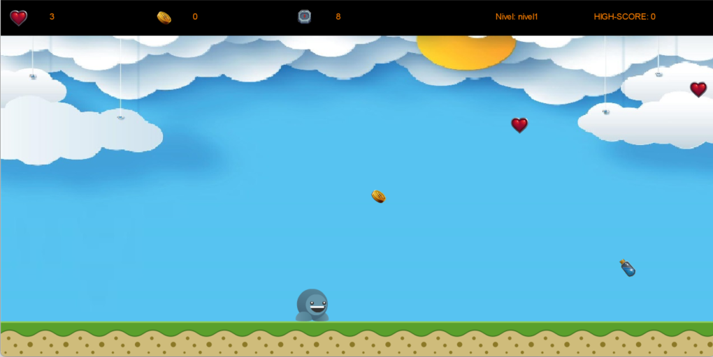

# El recaudador

## Equipo de desarrollo

- Ezequiel Quintana
- Camila Ponce Mc Gough
- Franco Sofia
- Lucila Coniglio

## Capturas

## Reglas de Juego / Instrucciones

### Niveles y Tiempo:

- Cada nivel tiene un límite de tiempo específico. ¡Apúrate para juntar tantas monedas como puedas antes de que se acabe el tiempo!

### Como Jugar 

#### 1. Inicio
- Comienza el juego 

#### 2. Recolecta Monedas:
- Desplázate por el nivel y agarra todas las monedas que encuentres.

#### 3. Evita obstaculos
- Hay obstáculos que pueden hacer que pierdas el juego. ¡Tene cuidado de no morir en el intento!

##### Obstáculos:
- Hielo: El hielo te conjela 5 segundos.
- Maza: Te quita una vida.
- Cráneo: Te mata instantáneamente.
- Cofre: No es atravesable, tendras que saltarlo para poder continuar moviendote por el tablero.

#### 3. Suma Vidas y Tiempo:
- Corazones: Agarra los corazones para sumar más vidas y así tener menos chances de perder.
- Relojes: Agarra relojes para tener 10 segundos más de tiempo y así poder juntar aún más monedas. 

### Canjea Beneficios Entre Nivel y Nivel
- Con tus monedas recaudadas, podrás comprar un beneficio entre cada nivel que te ayude a superar tu high score.

##### Beneficios:
- Monedas x2: Cada moneda valdrá el doble.
- Tiempo x2: Tendrás el doble de tiempo para recaudar tus monedas.
 
### Puntaje y High Score

- Solo se guardará tu puntaje más alto. ¡Intenta superar tu récord en cada partida!

### Juega Cuantas Veces Quieras
    
- Rejugabilidad: Podes jugar todas las veces que desees. ¡La clave es mejorar tu puntaje y superar tu récord!

## Otros

- Universidad Nacional de Quilmes.
- Curso: Programacion Orientada a Objetos, Comision 2.
- Versión de Wollok: Version 3.0.0
- Una vez terminado, no tenemos problemas en que el repositorio sea público.
